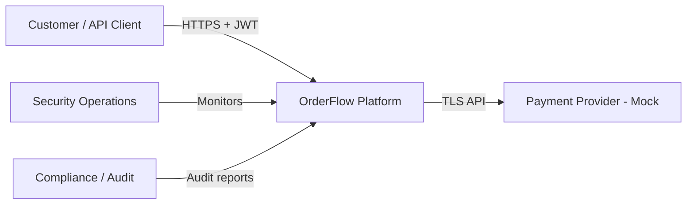
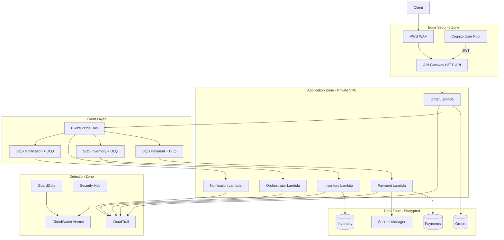

# Security Architecture — OrderFlow

---

## C4 Level 1: System Context



**Trust boundaries:** Internet (untrusted) → Edge (semi-trusted) → Application (trusted compute) → Data (highly protected)

---

## C4 Level 2: Container Diagram



---

## Security Data Flow — Happy Path

```
1. Client authenticates with Cognito → receives JWT (1h TTL)
2. POST /orders with Authorization: Bearer <jwt>
3. WAF inspects request (rate limit, OWASP rules)
4. API Gateway validates JWT signature and scope
5. Order Lambda:
   a. Validates Idempotency-Key
   b. Writes order (PENDING) to DynamoDB — KMS encrypted
   c. Publishes OrderCreated event (no PII in payload)
6. Payment worker processes async — reads secret from Secrets Manager
7. CloudTrail records all DynamoDB data events
```

---

## Security Data Flow — Credential Leak Scenario

```
1. GuardDuty detects anomalous IAM/API activity
2. Alarm fires → SNS → SecOps
3. Break-glass role disables compromised credential
4. Secrets Manager force-rotation triggered
5. CloudTrail queried for blast radius (last 24h)
6. Incident documented per INC-001 runbook
```

---

## Network Architecture

| Component | Subnet | Internet Access |
|-----------|--------|-----------------|
| Lambda functions | Private | Via VPC endpoints only |
| VPC endpoints | Private | DynamoDB, SQS, Secrets Manager, Logs, EventBridge |
| API Gateway | AWS managed | Public (protected by WAF) |
| NAT Gateway | Not required | Endpoints eliminate NAT for AWS APIs |

See [SEC-008 VPC endpoints ADR](../adr/SEC-008-vpc-endpoints.md).

---

## Defense in Depth Layers

| Layer | Control |
|-------|---------|
| 1. Perimeter | WAF, Shield Standard, rate limiting |
| 2. Identity | Cognito JWT, IAM roles, no long-lived keys |
| 3. Network | Private subnets, VPC endpoints, security groups |
| 4. Application | Input validation, idempotency, PII redaction |
| 5. Data | KMS encryption, least-privilege table access |
| 6. Detection | GuardDuty, Security Hub, CloudTrail, alarms |
| 7. Response | Runbooks, break-glass, secret rotation |

---

## Related Documents

- [Threat Model](../security/threat-model.md)
- [IAM Matrix](../security/iam-matrix.md)
- [Encryption Standard](../security/encryption-standard.md)
- [All Security ADRs](../adr/)
